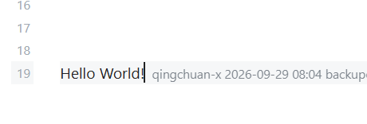

# GitLine

GitLine is an Obsidian desktop plugin that shows Git blame information at the end of the current cursor line. Each line displays the committer, the commit time, and the commit message, using a fully configurable format.



[简体中文版](README_zh.md)

## Features

- **Line-end blame**: the blame information of the current cursor line is rendered as an inline annotation at the end of the line.
- **Configurable format**: assemble the display freely with the `{date}`, `{time}`, `{author}`, `{message}` and `{hash}` placeholders.
- **Flexible timestamps**: choose between relative time (e.g. "3 days ago") and absolute time, accurate to the minute.
- **Uncommitted lines**: lines that have not been committed yet are marked as *Uncommitted*.
- **Status bar**: shows the author of the current line (optional).
- **Whitespace handling**: `git blame -w` can be enabled to ignore whitespace-only changes.
- **Caching**: an LRU cache avoids repeated `git` calls; entries are invalidated automatically when a file is saved.
- **Robustness**: git is detected automatically; a friendly hint is shown instead of an error when git is unavailable.

## Requirements

- Obsidian **desktop** (the plugin uses Node.js APIs and is desktop-only).
- **Git** installed and available on `PATH` (`git --version` must succeed).

## Installation

1. Copy the `gitline` plugin folder into `<your vault>/.obsidian/plugins/gitline/`.
2. In Obsidian, open **Settings → Community plugins**, and enable **GitLine**.

> Once the plugin is published, it can also be installed directly from the community plugin list.

## Usage

Open a note that lives in a Git repository and move the cursor. The blame information appears at the end of the current line.

## Settings

| Setting              | Description                                                                | Default                       |
| -------------------- | -------------------------------------------------------------------------- | ----------------------------- |
| Enable               | Master switch for the line-end blame display.                              | On                            |
| Display format       | Template with placeholders`{date} {time} {author} {message} {hash}`.     | `{author} {time} {message}` |
| Time style           | `Relative` (e.g. "3 days ago") or `Absolute` (accurate to the minute). | Absolute                      |
| Absolute time format | Moment format string.                                                      | `YYYY-MM-DD HH:mm`          |
| Uncommitted lines    | Show a marker on uncommitted lines.                                        | On                            |
| Ignore whitespace    | Map to`git blame -w`.                                                    | Off                           |
| Status bar           | Show the current line's author in the status bar.                          | On                            |
| Cache size           | Maximum number of files kept in the LRU cache.                             | 100                           |

## Development

```bash
npm install   # install dependencies
npm run dev   # watch and build main.js
npm run build # type-check and build for production
```

## License

[MIT](LICENSE)
